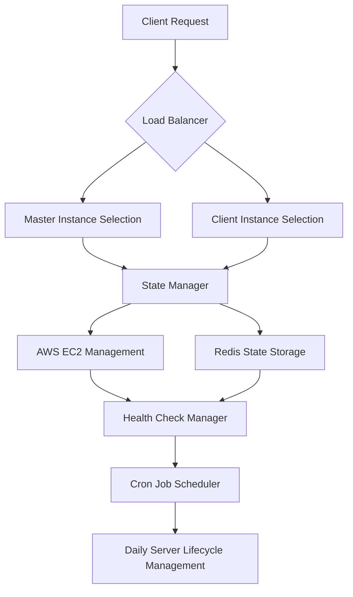

# Order Listener Load Balancer

## Overview

This project is a sophisticated load balancing and server management system designed for scalable order processing, utilizing AWS EC2 instances, Redis for state management, and a robust health checking mechanism.

## Key Features

-   Dynamic EC2 instance scaling
-   Intelligent load distribution
-   Redis-based state management
-   Periodic health checks
-   Automated server lifecycle management

## Architecture Components

-   **AWS Management**: Handles EC2 instance creation, termination, and scaling
-   **State Management**: Tracks instance states, user counts, and mappings
-   **Health Check Manager**: Monitors instance health and performance
-   **Cron Job Scheduler**: Automates daily server lifecycle

## Prerequisites

-   Node.js
-   AWS SDK
-   Redis
-   Axios
-   Winston Logger

## Getting Started

1. Clone the repository
2. Install dependencies: `npm install`
3. Configure AWS credentials and Redis connection
4. Set up environment variables
5. Run the application: `npm start`

## Configuration

Refer to detailed configuration instructions in [CONFIGURATION.md](./docs/CONFIGURATION.md)

## Deployment

Refer to [DEPLOYMENT.md](./docs/DEPLOYMENT.md) for deployment guidelines

## Contributing

Please read [CONTRIBUTING.md](./CONTRIBUTING.md) for details on our code of conduct and the process for submitting pull requests.

## License

This project is licensed under the MIT License - see the [LICENSE.md](./LICENSE.md) file for details.

# Configuration Guide

## Environment Variables

### AWS Configuration

-   `CONFIG.REGION`: AWS region for EC2 instances
-   `SERVER_CONFIG.ami_id`: AMI ID for launching instances
-   `SERVER_CONFIG.instance_type`: EC2 instance type
-   `SERVER_CONFIG.keyname`: SSH key pair name
-   `SERVER_CONFIG.role`: IAM instance profile
-   `SERVER_CONFIG.security_group`: Security group ID
-   `SERVER_CONFIG.subnet_id`: Subnet ID for instances

### Scaling Thresholds

-   `CONFIG.INITIAL_INSTANCE`: Number of instances to launch initially
-   `CONFIG.SCALING_THRESHOLD_CLIENT`: User count threshold for client instance scaling
-   `CONFIG.SCALING_THRESHOLD_MASTER`: User count threshold for master instance scaling
-   `CONFIG.MAX_USER_PER_MASTER_INSTANCE`: Maximum users per master instance

### Health Check Configuration

-   `checkInterval`: Frequency of health checks (default: 30000 ms)
-   `timeout`: Health check request timeout (default: 3000 ms)
-   `maxHistoryEntries`: Maximum health check history entries (default: 50)
-   `failureThreshold`: Consecutive failures before triggering notification (default: 5)

## Redis Configuration

### State Management Keys

-   `loadbalancer:global_state`: Global application state
-   `loadbalancer:instance_details`: Instance metadata
-   `loadbalancer:instance_user_counts`: Per-instance user counts
-   `loadbalancer:master_mapping`: Master-instance mappings
-   `loadbalancer:client_master_tracking`: Client-master relationships
-   `OrderListenerHealthManager:history:*`: Health check history
-   `OrderListenerHealthManager:stats:*`: Health check statistics

## Cron Job Schedule (IST)

-   Initial Server Launch: 11:52 PM
-   Terminate Instances: 11:55 PM

## Logging Configuration

Utilizes Winston logger with different log levels and output formats.

### Log Levels

-   `info`: General operational events
-   `error`: Error conditions
-   `notify`: Important system notifications

# System Architecture

## High-Level Architecture

## Component Interactions

### Load Balancer (Controller)

-   Receives incoming requests
-   Validates request payload
-   Determines appropriate instance type (master/client)
-   Proxies request to selected instance

### State Manager

-   Maintains in-memory and Redis-backed state
-   Tracks instance details, user counts, and mappings
-   Provides methods for:
    -   Finding available instances
    -   Tracking instance user counts
    -   Managing instance and client relationships

### AWS Management

-   Handles EC2 instance lifecycle
-   Launches instances based on scaling thresholds
-   Manages instance tagging and configuration

### Health Check Manager

-   Periodically checks instance health
-   Records health check history in Redis
-   Tracks consecutive failures
-   Triggers notifications on threshold exceedance

### Cron Job Scheduler

-   Automates daily server management
-   Launches initial server set
-   Terminates instances at end of day

## Request Flow

1. Client sends request to load balancer
2. Load balancer validates request
3. State manager determines appropriate instance
4. Request proxied to selected EC2 instance
5. Instance processes request
6. Response sent back to client

## Scaling Mechanism

### Master Instance Scaling

-   Track user count per master instance
-   Launch new master when threshold exceeded

### Client Instance Scaling

-   Monitor total client user count
-   Launch new client instances dynamically

## Failure Handling

-   Health check manager monitors instance health
-   Consecutive failures trigger system notifications
-   State manager facilitates instance replacement
